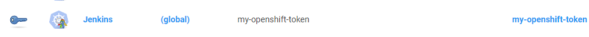

# openshift-k8s-credentials

[](https://ci.jenkins.io/job/Plugins/job/openshift-k8s-credentials-plugin/job/main/)
[](https://plugins.jenkins.io/openshift-k8s-credentials)
[](https://github.com/jenkinsci/openshift-k8s-credentials-plugin/releases/latest)
[](https://github.com/jenkinsci/openshift-k8s-credentials-plugin/blob/master/LICENSE.md)
[](https://plugins.jenkins.io/openshift-k8s-credentials)

## Introduction

This plugin provides an extension for the [kubernetes-credentials-provider-plugin](https://github.com/jenkinsci/kubernetes-credentials-provider-plugin)
plugin, and the [openshift-client-plugin](https://github.com/jenkinsci/openshift-client-plugin) that extend the kubernetes credentials provider to create the special credential type required by the openshift-client-plugin when interacting with an openshift cluster.

## Getting started

The plugin consume Kubernetes credentials of type 'openshiftToken'.

You will find an example bellow

```
apiVersion: v1
data:
  text: c3VwZXJkdXBlcnNlY3JldA==
kind: Secret
metadata:
  annotations:
    jenkins.io/credentials-description: The Openshift token to access the cluster
  labels:
    jenkins.io/credentials-type: openshiftToken
  name: my-openshift-token
  namespace: jenkins-demo
type: Opaque
```

This will create the secret on the Kubernetes credentials store.



## LICENSE

Licensed under MIT, see [LICENSE](LICENSE.md)
